# Evidencias del sistema operativo

Capturas de pantalla completas de ejecuciones reales en Debian 13 (máquina
virtual `SO2026-DanielEspinosa`, 3 núcleos, 1,93 GB de RAM), tomadas el
2026-10-01. Cada captura incluye el comando, lo que se observa y por qué ocurre.

Los PID cambian en cada ejecución; dentro de un mismo bloque corresponden a la
misma corrida.

| # | Captura | Requisito |
|---|---|---|
| 01 | [Sistema iniciado](Capturas/01-sistema-iniciado.png) | R1, R2, R10 |
| 02 | [Jerarquía con pstree](Capturas/02-pstree-jerarquia.png) | R1, R2, R3 |
| 03 | [PID, PPID y número de hilos](Capturas/03-ps-pid-ppid-nlwp.png) | R2, R3, R10 |
| 04 | [Cada hilo con su LWP](Capturas/04-ps-hilos-lwp.png) | R3, R10 |
| 05 | [Datos del kernel en /proc](Capturas/05-proc-status-task.png) | R10 |
| 06a | [htop en árbol, escenario secuencial](Capturas/06a-htop-arbol-secuencial.png) | R10, R11 |
| 06b | [htop, escenario concurrente](Capturas/06b-htop-concurrente.png) | R10, R11 |
| 07 | [Condición de carrera (antes)](Capturas/07-carrera-antes-race.png) | R4, R5 |
| 08 | [Corrección con exclusión mutua (después)](Capturas/08-carrera-despues-safe.png) | R6 |
| 09 | [Interbloqueo: hilos bloqueados](Capturas/09-interbloqueo-hilos-bloqueados.png) | R8 |
| 10 | [Interbloqueo: diagnóstico](Capturas/10-interbloqueo-diagnostico.png) | R8 |
| 11 | [Interbloqueo corregido](Capturas/11-interbloqueo-corregido.png) | R9 |
| 12 | [Productor-consumidor](Capturas/12-productor-consumidor.png) | R7 |
| 13 | [Línea base secuencial](Capturas/13-secuencial-linea-base.png) | Comparación |

Los diagramas de diseño están en [Esquemas/](Esquemas/README.md) y los
resultados de las pruebas de carga en [load-tests/](load-tests/report.md).

---

## Bloque A: procesos e hilos (capturas 01 a 05)

Misma ejecución para las cinco capturas. Terminal 1 (sistema):

```bash
python3 -m src.main --workers 2 --threads-per-worker 4 --processing-delay 60
```

Terminal 2 (8 pedidos simultáneos, uno por hilo):

```bash
for i in $(seq 1 8); do python3 -m src.client --customer-id C-$i --product-id PRODUCT-001 --quantity 1 & done; wait
```

### 01. Sistema iniciado

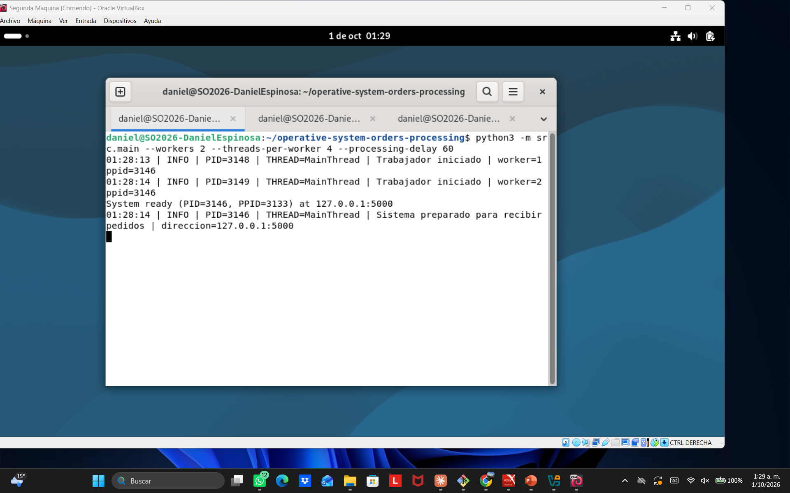

**Se observa:** `System ready (PID=3146, PPID=3133)` y dos trabajadores con
`PID=3148` y `PID=3149`, ambos con `ppid=3146`.

**Explicación:** el proceso principal (3146) crea dos procesos trabajadores, y
cada uno registra que su padre es 3146. El PPID del servidor (3133) es la terminal
desde donde se lanzó.

### 02. Jerarquía de procesos con pstree

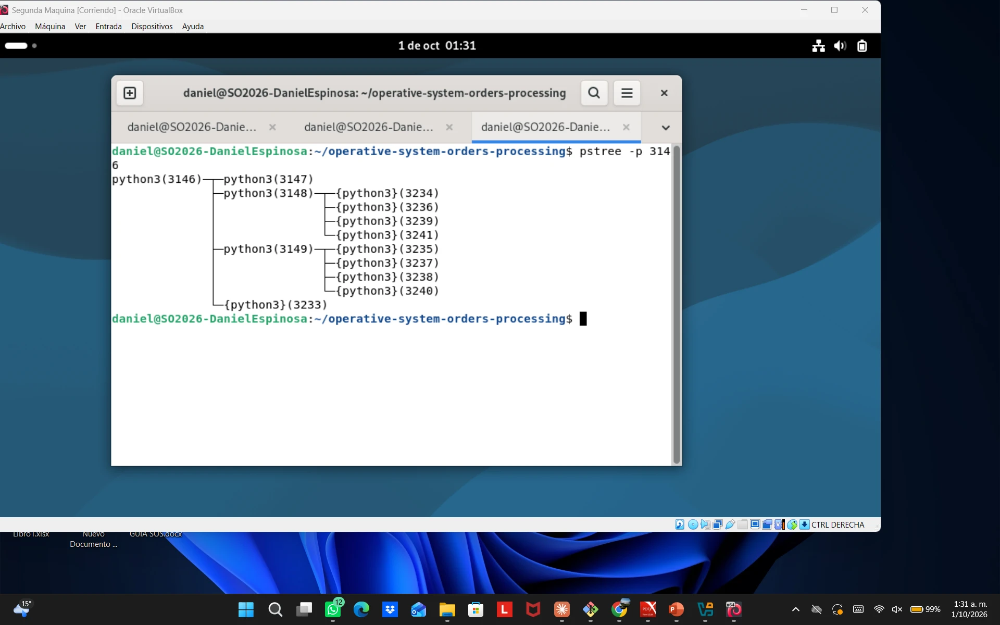

```bash
pstree -p 3146
```

**Se observa:**

| Nodo | Qué es |
|---|---|
| `python3(3146)` | Servidor (proceso principal) |
| `python3(3147)` | `resource_tracker`: auxiliar de `multiprocessing` que libera semáforos y memoria compartida; no procesa pedidos |
| `python3(3148)` con `{python3}(3234, 3236, 3239, 3241)` | Trabajador 1 y sus 4 hilos del pool |
| `python3(3149)` con `{python3}(3235, 3237, 3238, 3240)` | Trabajador 2 y sus 4 hilos del pool |
| `{python3}(3233)` | Hilo del servidor: `QueueFeederThread` de la cola |

**Explicación:** el servidor es padre de los dos trabajadores y del
`resource_tracker`. Los hilos aparecen entre llaves con su TID; `pstree` no
muestra el hilo principal de cada proceso. Los TID intercalados entre los dos
trabajadores (3234 en el 1, 3235 en el 2…) muestran que los hilos se crearon de
forma concurrente al llegar los 8 pedidos a la vez.

### 03. PID, PPID y número de hilos

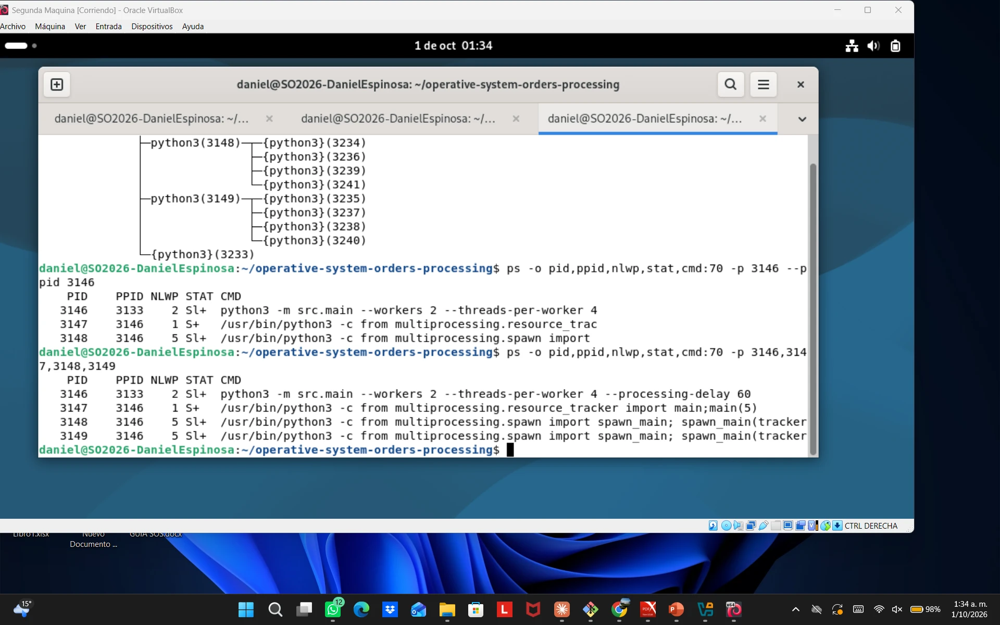

```bash
ps -o pid,ppid,nlwp,stat,cmd:70 -p 3146,3147,3148,3149
```

La última tabla de la captura es la válida (la anterior, con `--ppid`, omitió
una fila).

**Se observa:** los tres hijos tienen `PPID 3146`. `NLWP` (número de hilos) es 2
en el servidor, 1 en el `resource_tracker` y 5 en cada trabajador. `CMD`
distingue al `resource_tracker` de los trabajadores (`spawn_main`).

**Explicación:** cada trabajador tiene 5 hilos (el principal más 4 del pool) y el
servidor 2, para un total de 12, el mismo valor de "Hilos pico" que registraron
las pruebas de carga. El estado `Sl+` indica un proceso multihilo (`l`) que espera
sin consumir CPU (`S`) en primer plano (`+`).

### 04. Cada hilo con su identificador (LWP)

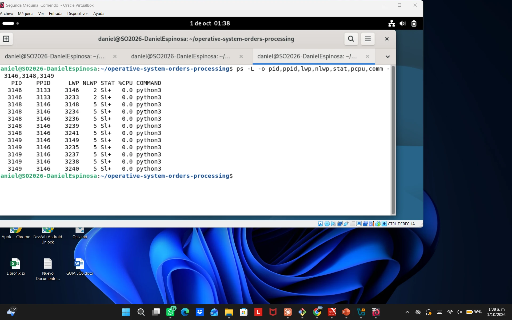

```bash
ps -L -o pid,ppid,lwp,nlwp,stat,pcpu,comm -p 3146,3148,3149
```

**Se observa:** 12 filas, una por hilo. Los hilos de un mismo proceso comparten
el PID y cada uno tiene su LWP. El hilo principal tiene LWP igual al PID.

**Explicación:** el servidor tiene 2 hilos (3146 y 3233) y cada trabajador 5. Al
terminar los pedidos, todos quedan en estado `S` con 0 % de CPU: el pool los
reutiliza para los pedidos siguientes en lugar de crearlos de nuevo. `COMMAND`
dice `python3` en todos porque Python no asigna nombres visibles a los hilos en
el sistema operativo.

### 05. Datos del kernel en /proc

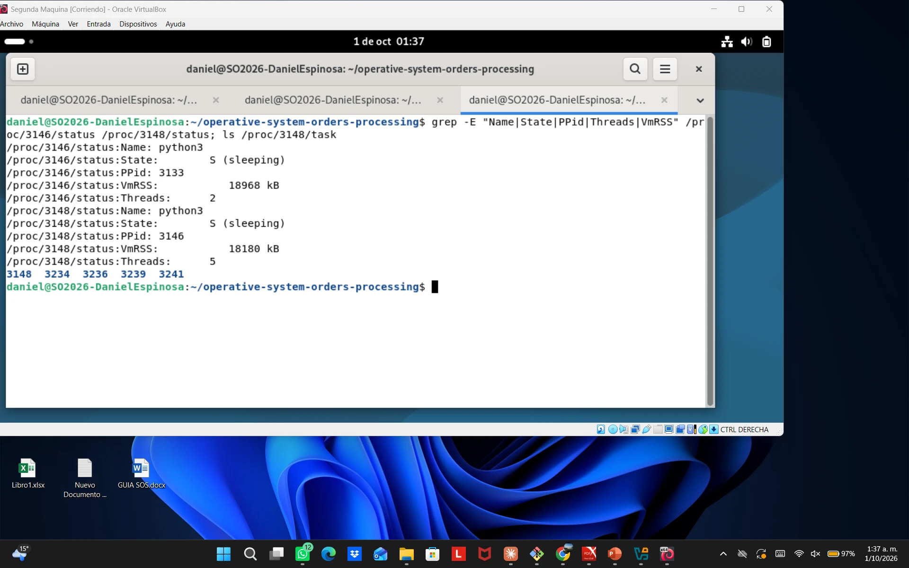

```bash
grep -E "Name|State|PPid|Threads|VmRSS" /proc/3146/status /proc/3148/status; ls /proc/3148/task
```

**Se observa:**

| Dato | Servidor (3146) | Trabajador 1 (3148) |
|---|---|---|
| State | S (sleeping) | S (sleeping) |
| PPid | 3133 | 3146 |
| Threads | 2 | 5 |
| VmRSS | 18 968 kB | 18 180 kB |

`/proc/3148/task` contiene 5 carpetas: 3148, 3234, 3236, 3239 y 3241.

**Explicación:** `/proc` expone la información que el kernel mantiene de cada
proceso, y de ahí la toman `ps` y `top`. Cada hilo tiene su carpeta en
`/proc/<pid>/task`, con los mismos TID que mostró `pstree`. Cada proceso ocupa
unos 18 MB de memoria física propia; el inventario es lo único que comparten,
mediante memoria compartida.

---

## Bloque B: CPU y memoria bajo carga (capturas 06a y 06b)

Terminal 3: `htop` filtrado por `python` (F4). Terminal 2:

```bash
python3 scripts/run_experiments.py --quantities 1000 --concurrency 100
```

### 06a. htop en árbol, escenario secuencial

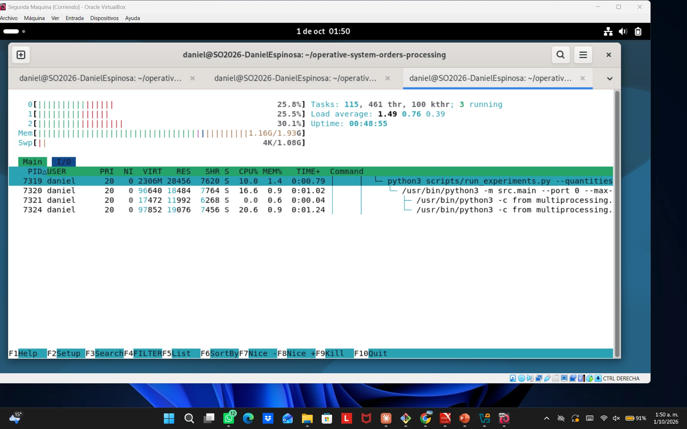

**Se observa:** el script de pruebas (7319) lanza el servidor (7320, 16,6 % de
CPU), que crea el `resource_tracker` (7321, 0 %) y un trabajador (7324, 20,6 %).

**Explicación:** en vista de árbol, htop muestra la jerarquía durante la carga.
En el escenario secuencial hay un solo trabajador, que es el que más CPU usa
porque ahí se procesan los pedidos; el `resource_tracker` permanece inactivo.

### 06b. htop, escenario concurrente

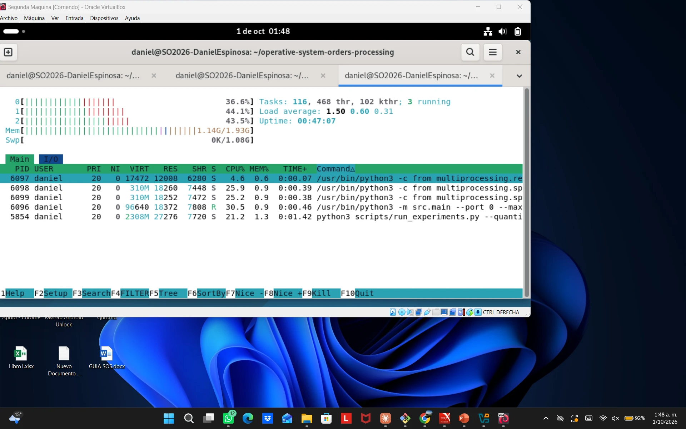

**Se observa:** el servidor (6096, 30,5 %, estado `R`) y los dos trabajadores
(6098 con 25,9 % y 6099 con 25,2 %) consumen CPU al mismo tiempo. Los tres
núcleos tienen carga simultánea (36,6 %, 44,1 % y 43,5 %) y hay 3 procesos en
ejecución. Cada proceso usa unos 18 MB de memoria residente (RES).

**Explicación:** al ser procesos distintos, el sistema operativo los reparte
entre núcleos: hay paralelismo real, que no ocurriría con hilos de un único
proceso por el GIL de Python. La suma de CPU de varios procesos es la razón de
que las pruebas de carga registren picos mayores a 100 %.

Después de esta prueba se restauraron los resultados originales con
`git checkout -- evidence/load-tests`.

---

## Bloque C: condición de carrera (capturas 07 y 08)

Terminal 2, igual en ambas pruebas (dos compras simultáneas del mismo producto):

```bash
for i in A B; do python3 -m src.client --customer-id C-$i --product-id PRODUCT-001 --quantity 1 & done; wait
```

### 07. Antes: sin exclusión mutua

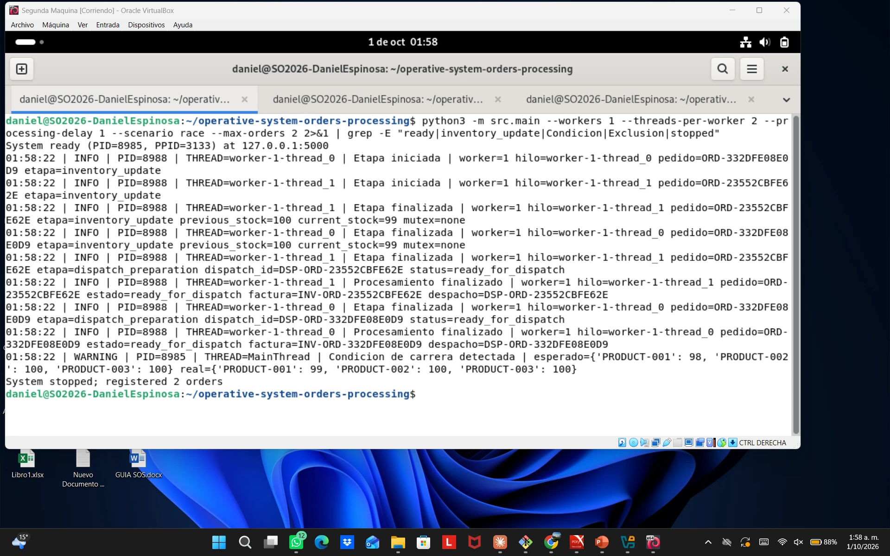

```bash
python3 -m src.main --workers 1 --threads-per-worker 2 --processing-delay 1 --scenario race --max-orders 2 2>&1 | grep -E "ready|inventory_update|Condicion|Exclusion|stopped"
```

**Se observa:** `thread_0` y `thread_1` inician `inventory_update` en el mismo
segundo, y ambos registran `previous_stock=100 current_stock=99 mutex=none`. Al
final: `Condicion de carrera detectada | esperado PRODUCT-001: 98, real: 99`.

**Explicación:** ambos hilos leen 100 antes de que el otro escriba, y ambos
escriben 99. Una venta quedó registrada y facturada, pero no descontada del
inventario: es una actualización perdida, porque la secuencia leer → calcular →
escribir no es atómica y se ejecuta sin exclusión mutua.

### 08. Después: con inventory_lock

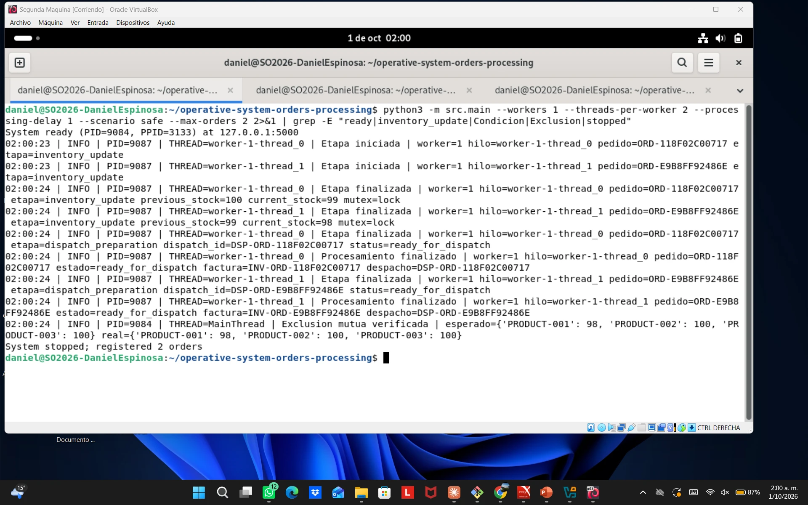

```bash
python3 -m src.main --workers 1 --threads-per-worker 2 --processing-delay 1 --scenario safe --max-orders 2 2>&1 | grep -E "ready|inventory_update|Condicion|Exclusion|stopped"
```

**Se observa:** un hilo registra `100 → 99` y el otro `99 → 98`, ambos con
`mutex=lock`. Al final: `Exclusion mutua verificada | esperado 98, real 98`.

**Explicación:** la misma prueba, con la misma ventana de carrera, pero la
actualización del inventario se protege con `inventory_lock`. Ambos hilos inician
la etapa a la vez, pero solo uno entra a la sección crítica; el segundo espera y
lee el valor ya actualizado. El lock serializa solo esa sección; las demás etapas
siguen en paralelo.

| | 07 (race) | 08 (safe) |
|---|---|---|
| Hilo 0 | 100 → 99, `mutex=none` | 100 → 99, `mutex=lock` |
| Hilo 1 | **100** → 99, `mutex=none` | **99** → 98, `mutex=lock` |
| Resultado | esperado 98, **real 99** | esperado 98, **real 98** |

---

## Bloque D: interbloqueo (capturas 09 a 11)

### 09. Hilos bloqueados

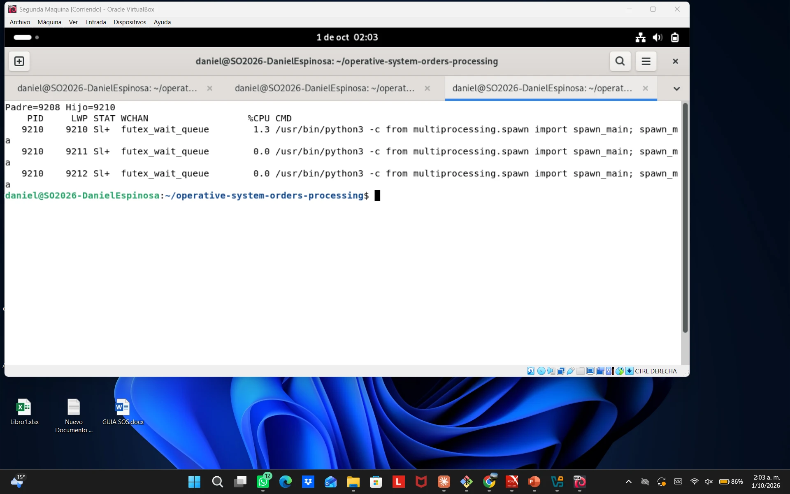

Terminal 1:

```bash
python3 -m src.main --scenario deadlock --deadlock-timeout 60
```

Terminal 3, mientras el sistema está congelado:

```bash
DSRV=$(pgrep -f "scenario deadlock" | head -1); DCH=$(pgrep -P $DSRV -f spawn_main); echo "Padre=$DSRV Hijo=$DCH"; ps -L -o pid,lwp,stat,wchan:22,pcpu,cmd:40 -p $DCH
```

**Se observa:** proceso padre 9208 e hijo 9210. Los hilos 9211 (pedido A) y
9212 (pedido B) están en estado `S`, con 0,0 % de CPU, detenidos en
`futex_wait_queue`. El hilo 9210 es el principal del hijo, que espera a los otros
dos.

**Explicación:** `futex_wait_queue` es la función del kernel donde un hilo duerme
esperando un lock. Ningún hilo avanza: A tiene `inventory_lock` y espera
`invoice_lock`, y B tiene `invoice_lock` y espera `inventory_lock`. El sistema no
falla ni consume CPU; simplemente se congela. Es el síntoma de "tareas que parecen
quedar esperando" descrito en el problema.

### 10. Diagnóstico del interbloqueo

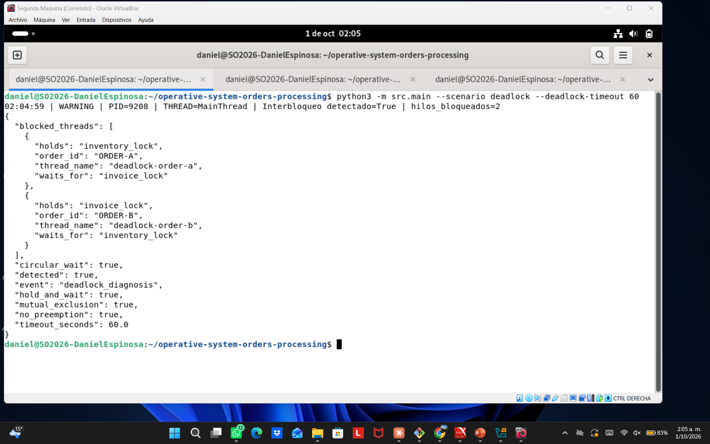

Salida de la misma ejecución de la captura 09 (padre PID 9208).

**Se observa:** `Interbloqueo detectado=True | hilos_bloqueados=2`.
`ORDER-A` retiene `inventory_lock` y espera `invoice_lock`; `ORDER-B` retiene
`invoice_lock` y espera `inventory_lock`. Las cuatro condiciones de Coffman
(`mutual_exclusion`, `hold_and_wait`, `no_preemption`, `circular_wait`) están en
`true`.

**Explicación:** se cumplen las cuatro condiciones necesarias para el
interbloqueo: exclusión mutua (cada lock lo tiene un solo hilo), retención y
espera (cada hilo conserva su lock mientras pide el otro), sin expropiación
(ningún hilo puede quitarle el lock a otro) y espera circular (A espera a B y B
espera a A). Basta con eliminar una para evitarlo.

### 11. Después: orden global de locks

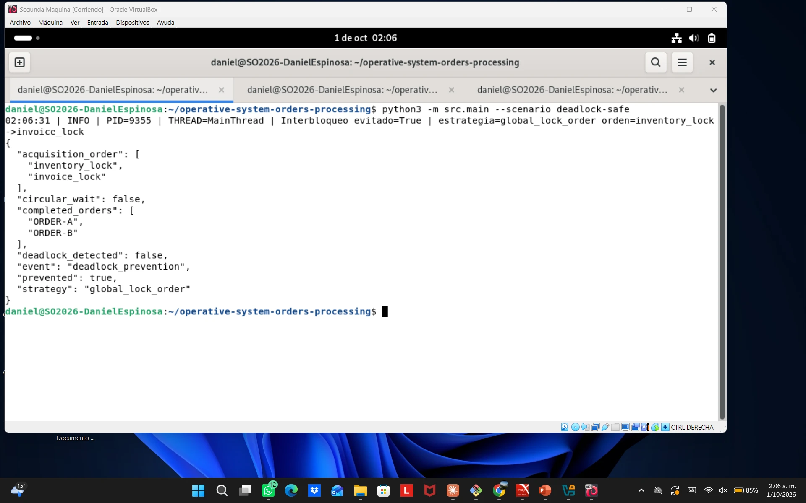

```bash
python3 -m src.main --scenario deadlock-safe
```

**Se observa:** `Interbloqueo evitado=True | estrategia=global_lock_order
orden=inventory_lock->invoice_lock`, `completed_orders: ORDER-A, ORDER-B`,
`deadlock_detected: false` y `circular_wait: false`.

**Explicación:** ambos pedidos adquieren los recursos en el mismo orden. Si B
encuentra `inventory_lock` ocupado, espera sin retener `invoice_lock`, así que no
puede formarse la espera circular (se rompe la cuarta condición de Coffman). Los
mismos dos pedidos pasan de quedar bloqueados hasta que el detector los termina a
completarse en menos de un segundo, sin depender de timeouts.

---

## Bloque E: productor-consumidor y línea base (capturas 12 y 13)

### 12. Cola productor-consumidor

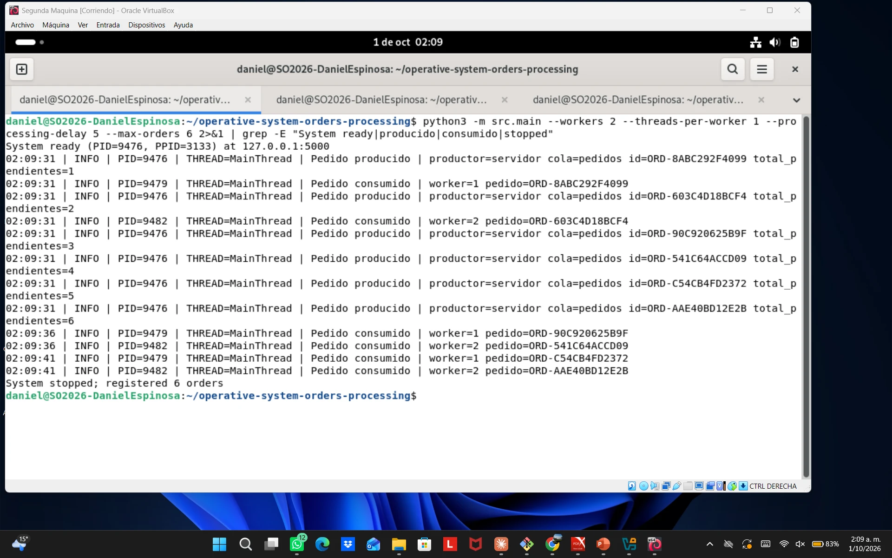

```bash
python3 -m src.main --workers 2 --threads-per-worker 1 --processing-delay 5 --max-orders 6 2>&1 | grep -E "System ready|producido|consumido|stopped"
```

```bash
for i in $(seq 1 6); do python3 -m src.client --customer-id C-$i --product-id PRODUCT-002 --quantity 1 & done; wait
```

**Se observa:** a las 02:09:31 el servidor (PID 9476) produce los 6 pedidos
(`total_pendientes` de 1 a 6). Los trabajadores (9479 y 9482) los consumen de a
dos, a las 02:09:31, 02:09:36 y 02:09:41.

**Explicación:** el proceso principal es el productor y los trabajadores son los
consumidores. Cada trabajador, con un solo hilo, toma el siguiente pedido solo
cuando termina el anterior; los demás esperan en el búfer sin perderse. Como
`queue.get()` es atómico, cada pedido lo retira un único consumidor: ninguno se
procesa dos veces, lo que resuelve el síntoma de "pedidos procesados dos veces".

### 13. Línea base secuencial

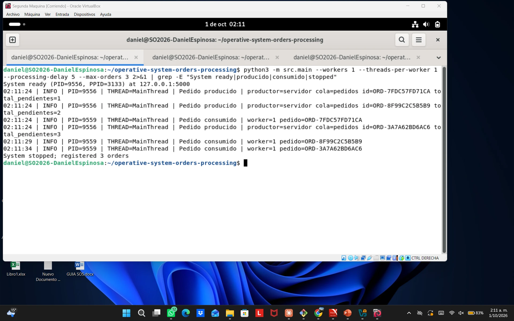

```bash
python3 -m src.main --workers 1 --threads-per-worker 1 --processing-delay 5 --max-orders 3 2>&1 | grep -E "System ready|producido|consumido|stopped"
```

```bash
for i in $(seq 1 3); do python3 -m src.client --customer-id C-$i --product-id PRODUCT-003 --quantity 1 & done; wait
```

**Se observa:** los 3 pedidos entran a la cola a las 02:11:24, pero el único
trabajador los consume de uno en uno: 02:11:24, 02:11:29 y 02:11:34.

**Explicación:** sin concurrencia, los pedidos esperan en fila. Con dos
trabajadores (captura 12) se atienden dos a la vez y el ritmo se duplica; a mayor
escala, eso produce la mejora de 7,1× medida en las pruebas de carga.

| | 12 (2 trabajadores × 1 hilo) | 13 (1 trabajador × 1 hilo) |
|---|---|---|
| Consumo | de a 2 cada 5 s | de a 1 cada 5 s |
| Pedidos retirados de la cola en 10 s | 6 | 3 |
